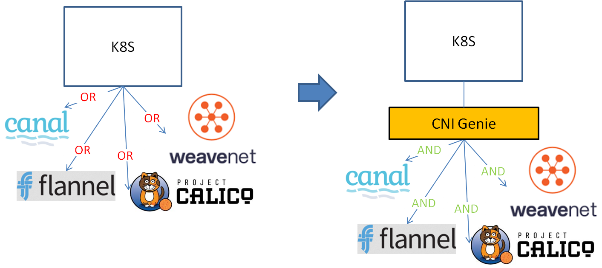
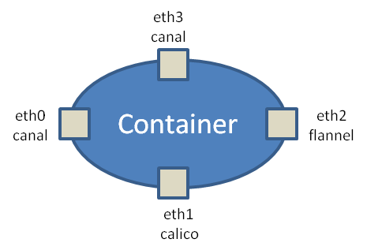

# CNI-Genie

CNI-Genie enables container orchestrators ([Kubernetes](https://github.com/kubernetes/kubernetes), [Mesos](https://mesosphere.com/)) to seamlessly connect to choice of CNI plugins ([Calico](https://github.com/projectcalico/calico), [Canal](https://github.com/projectcalico/canal), [Romana](https://github.com/romana/romana), [Weave](https://github.com/weaveworks/weave)) configured on a Node. Without CNI-Genie, kubelet is bound to a signle CNI plugin passed to kubelet on start. CNI-Genie allows for multiple CNI plugins being available to kubelet simultaneously. 

***Note: this repo is still in inital development phase, so expect cracking sounds at times! :)***

***Also please note that this initial proto-type is tested only with Kubernetes build. Mesos will be coming soon...***

## Demo
Here is a 6 minute demo video that demonstrates 3 scenarios
1. Assign IP to pod from a particular network solution eg; Get IP from "Weave"
2. Assign multi-IP to pod from multiple network solutions eg: Get 1 IP from "Weave" 2nd IP from "Canal"
3. Assign IP to pod from IDEAL network solution eg: Canal has less load, CNI-Genie assigns IP to pod from Canal

## Contributing
We always welcome contributions to our little experiment. 
Feel free to reach out to these folks:

karun.chennuri@huawei.com

kaveh.shafiee@huawei.com

# Why we created CNI-Genie?

CNI Genie is an add-on to [Kuberenets](https://github.com/kubernetes/kubernetes) open-source project and is designed to provide the following features:

1. [Multiple CNI plugins](docs/multiple-cni-plugins/README.md) are available to users in runtime. This figure shows Kubernetes CNI Plugin landscape before and after CNI-Genie
   
    - User-story: based on "performance" requirements, "application" requirements, “workload placement” requirements, the user could be interested to use different CNI plugins for different application groups
    - Different CNI plugins are different in terms of need for port-mapping, NAT, tunneling, interrupting host ports/interfaces
    
[Watch multiple CNI plugins demo](https://github.com/Huawei-PaaS/CNI-Genie/blob/master/docs/multiple-cni-plugins/README.md#demo)

2. The user can manually select one (or more) CNI plugin(s) to be added to containers upon creating them. [Multiple IP addresses](docs/multiple-ips/README.md) can be injected into a single container making the container reachable across multiple networks
   
    - User-story: in a serverless platform the “Request Dispatcher” container that receives requests from customers of all different tenants needs to be able to pass the request to the right tenant. As a result, is should be reachable on the networks of all tenants
    - User-story: many Telecom vendors are adopting container technology. For a router/firewall application to run in a container, it needs to have multiple interfaces
    
[Watch multiple IP addresses demo](https://github.com/Huawei-PaaS/CNI-Genie/blob/master/docs/multiple-ips/README.md#demo)

[Watch multiple IP addresses PER POD demo](https://github.com/Huawei-PaaS/CNI-Genie/blob/master/docs/multiple-ips/README.md#feature-2-extension-cni-genie-multiple-ip-addresses-per-pod):  not only assign IP addresses to the container, but also to the Pod

3. The user can leave the CNI plugin selection to CNI-Genie. CNI-Genie maintains a list of Key Performance Indicators (KPIs) to [smartly select one (or more) CNI plugin](docs/smart-cni-genie/README.md)
    - CNI Genie maintains a list of KPIs for every CNI plugin including occupancy rate, number of subnets, network latency, available network bandwidth    
    - CNI Genie maintains a list of KPIs for every container, e.g., network bandwidth utilization

4. [CNI-Genie network policy engine](docs/network-policy/README.md) for network level ACLs

Note: CNI Genie is NOT a routing solution! It gets IP addresses from various CNSs

### More docs here [Getting started](docs/GettingStarted.md), [CNI-Genie Feature Set](docs/CNIGenieFeatureSet.md)
