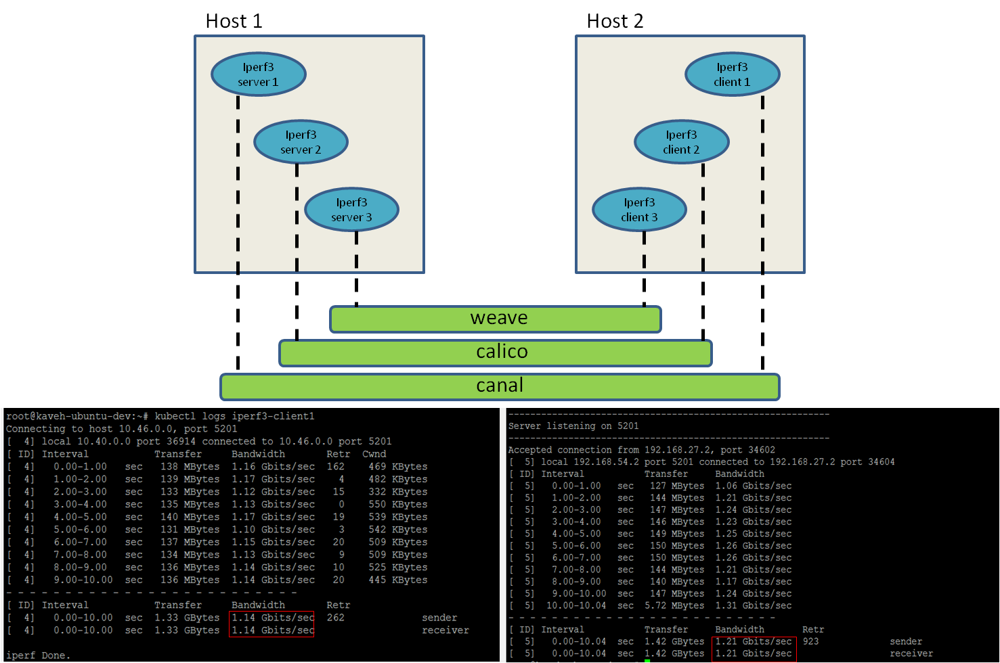

## You can find here our [existing & future features covered in CNI-Genie](../CNIGenieFeatureSet.md)

# Feature 3: CNI-Genie "Smart CNI Plugin Selection"

# Introduction

  - Upon creating a pod, the user can manually select the logical network, or multiple logical networks, that the pod should be added to
  - Alternatively, the user can decide to include no logical network in pod yaml configuration. In this case, CNI-Genie smartly selects one of the available CNI plugins
  - For this purpose, CNI-Genie talks to cAdvisor to collect network usage information for every container, maintains a list of KPIs for all available CNI plugins. Examples of such KPIs are
    - Network latency
    - Network bandwidth
    - End-to-end response time
    - Percentage of IP addresses used, i.e., (# of IP addresses used)/(Total # of IP addresses)
    - Occupancy rate
    - A questionnaire filled out by the user to find use-case-optimized CNI plugin
    
# How it works now

In this case user leaves it to CNI-Genie to decide ideal logical network to be selected for a pod. The pod yaml looks like this:

```yaml
apiVersion: v1
kind: Pod
metadata:
  name: nginx-smart-pick
  labels:
    app: web
  annotations:
    cni: "genie"
spec:
  containers:
    - name: key-value-store
      image: nginx:latest
      imagePullPolicy: IfNotPresent
      ports:
        - containerPort: 6379
```

- CNI-Genie talks to cAdvisor to collect Network usage information from every container. It in turn computes downlink using RxBytes information (pending computation of uplink using TxBytes). Returns string array of solutions in the order of usage (least usage to high usage).
- CNI-Genie assigns the pod to use solution that has least network usage.

# Available options for CNI plugin selection based on "Network Bandwidth" usage
   
- Option 1: Measure bandwidth usage via [iperf3](https://iperf.fr/)

In this case, we run a pair of iperf3 client & server pods on every available plugin. The iperf3 client is used to measure the bandwidth usage for a given plugin. 
       

    
- Option 2: Measure bandwidth usage of containers

In this case, for every plugin we measure the bandwidth usage of all of the containers using that plugin. We write a [cAdvisor](https://github.com/google/cadvisor) client that collects network usage information from every container, computes uplink and downlink bandwidth usage of each plugin, orders the plugins in the ascending order of their usage in every node. CNI-Genie then selects the plugin that is the least used in the node for pod networking.
